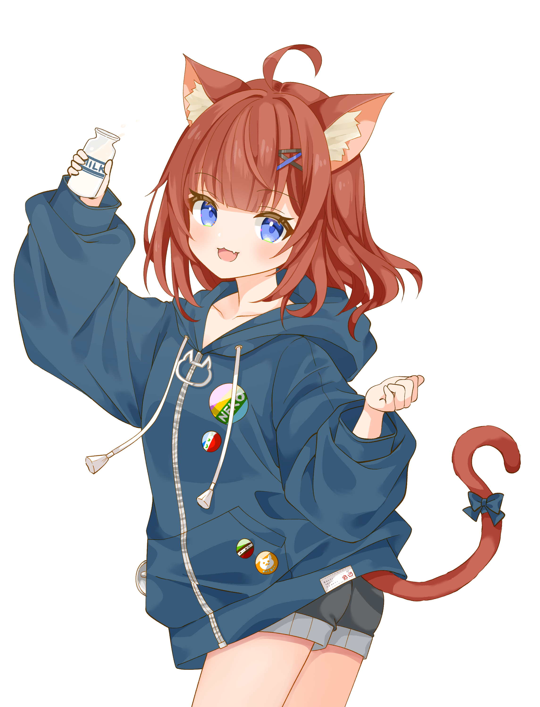

<h3 align="center">
  
  👋 Hello, nice to meet you
</h3>

  I'm a Computer Science student and software developer from Germany.
  I like building weird, useful, and sometimes slightly cursed things with
  <b>Rust</b>, <b>C#</b>, <b>Go</b>, <b>PHP</b>, and <b>JavaScript</b>.  
  Many of my projects are self-hosted inside my Kubernetes cluster.

  I'm open to collaboration! If you have ideas, improvements, bug reports,
  or just want to poke at something I made, feel free to open an issue or pull
  request on any of my projects.

<ul>
  <li>
    Learn more about me and my projects at 
    <a href="https://meisterlala.dev/"><b>meisterlala.dev</b></a>
  </lir>
  <li>
    Support my work with a
    <a href="https://ko-fi.com/Meisterlala"><b>small donation on Ko-Fi</b></a>
  </li>
  <li>
    If GitHub is down again, everything is mirrored on my 
    <a href="https://forgejo.meisterlala.dev/misti"><b>Foregejo instance</b></a>
  </li>
  <li>
    Or make a Federated Pull request on my
    <a href="https://tangled.org/meisterlala.dev"><b>Tangled.org Profile</b></a>
  </li>
</ul>

  You can contact me via Email at
  <a href="mailto:github@meisterlala.dev"><b>github@meisterlala.dev</b></a>  
  or send a message on Matrix to
  <a href="https://matrix.to/#/@misti:meisterlala.dev"><b>@misti:meisterlala.dev</b></a>

 

  

